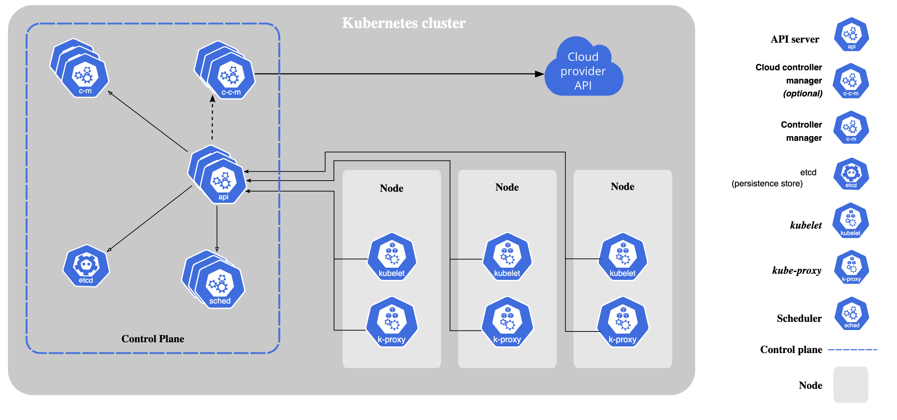

## 쿠버네티스란

많은 서비스들이 Docker와 같은 Container 기술들을 통해 배포되고 있습니다. 이러한 Container 기술들은 다음과 같은 장점들을 가지고 있습니다.

- Infrastructure에 구애받지 않고 Application이 동작한다.
- local에서 테스트하고 cloud server에서 동일하게 배포할 수 있다.
- 기존의 Virtual Machine 기반의 기술들과 비교해 볼 때 가볍다.

kubernetes는 이러한 Container로 동작하는 서비스들이 안정적으로 동작할 수 있도록 도와주는 도구입니다. 특정 기능을 제공하는 Container가 어떤 이유로 다운되었을 때, 이를 대체할 새로운 Container를 생성하여 서비스의 항상성을 유지해주기도 하고, 특정 Container에 많은 트래픽이 몰리지 않도록 load balancing 기능을 제공하기도 합니다. 구체적으로 [Kubernetes 홈페이지](https://kubernetes.io/docs/concepts/overview/what-is-kubernetes/)에서 언급하고 있는 kubernetes의 기능들은 다음과 같습니다.

- Service discovery and load balancing: 많은 트래픽이 몰릴 때 load balancing 해주어 안정적인 배포가 가능하도록 한다.
- Storage orchestration: 다양한 storage를 사용할 수 있다.
- Automated rollouts and rollbacks: 배포 중인 서비스를 쉽게 업데이트할 수 있도록 한다.
- Automatic bin packing: Container가 필요로하는 자원의 크기와 Cluster의 개별 node가 가지고 있는 자원을 고려하여 적절하게 분배한다.
- Self-healing: 실패한 Conatiner를 새로 생성하고, 응답이 없는 Container는 제거하여 서비스를 유지할 수 있도록 한다.
- Secret and configuration management: 보안 상 중요한 정보들을 격리하여 안정적으로 관리할 수 있도록 한다.

## 쿠버네티스의 구성요소

Kubernetes는 여러 컴퓨터를 묶어 하나의 Cluster 처럼 동작할 수 있도록 합니다. 이때 개별 컴퓨터를 Node(또는 Worker Node)라고 부릅니다. 그리고 이러한 Node들을 통합적으로 관리하는 주체를 Control Plane 이라고 합니다. [kubernetes 홈페이지](https://kubernetes.io/docs/concepts/overview/components/)의 아래 이미지를 통해 보다 직관적으로 이해할 수 있습니다.



## 1. Control Plane Components

kubenetes Cluster에는 Cluster를 유지, 관리하기 위한 목적으로 다음과 같은 요소들이 동작하고 있습니다.

```bash
$ kubectl get pods -n kube-system
NAME                               READY   STATUS    RESTARTS        AGE
coredns-78fcd69978-f64td           1/1     Running   1 (2m44s ago)   10d
etcd-minikube                      1/1     Running   1 (2m44s ago)   10d
kube-apiserver-minikube            1/1     Running   1 (2m44s ago)   10d
kube-controller-manager-minikube   1/1     Running   1 (4d1h ago)    10d
kube-proxy-4j6lx                   1/1     Running   1 (4d1h ago)    10d
kube-scheduler-minikube            1/1     Running   1 (2m44s ago)   10d
storage-provisioner                1/1     Running   3 (90s ago)     10d
```

Kubernetes를 관리하는 Master node는 다음과 같은 요소들로 이뤄져 있습니다.

- Kube Api Server
- ETCD Cluster
- Kube Controller Manager
- Kube Scheduler

### 1.1. Kube Api Server

- 사용자의 Request를 받아서 쿠버네티스의 구성요소들에 적절한 명령을 전달하는 서버.
- pod 생성하는 Request를 전달받았을 때 Api Server가 하는 작업들은 다음과 같습니다.
  1. Authenticate User
  2. Valiate Request
  3. Retrieve data
  4. Update ETCD
  5. Scheduler
  6. Kubelet -> Build image
  7. Update ETCD

### 1.2. ETCD Cluster

- 분산 환경에서 key-value 형태의 데이터를 저장할 수 있도록 하는 서비스.
- 쿠버네티스에서는 etcd를 사용하여 `kubectl get` 으로 확인할 수 있는 모든 정보들을 저장합니다.

### 1.3. Kube Controller Manager

- 쿠버네티스에는 다양한 component의 상태를 지속적으로 관리하고, 문제가 발생했을 때 적절히 대응하는 Controller가 있습니다. 대표적으로는 아래와 같은 것들이 있습니다.
  - Node Controller
  - Replication Controller
  - Deployment Controller
  - ...
- Controller Manager는 이러한 Controller들을 관리(Control Loop)하는 역할을 수행합니다.
- 예를 들어 Job Controller가 새로운 Task의 존재를 인식하였다면 이를 적절히 처리해 줄 Pod를 생성하라는 명령을 Kube Api Server에 전달하여 Pod이 생성되도록 합니다.

### 1.4. Kube Scheduler

- 어떤 Pod가 어떤 Node에 할당될 것인지 결정하는 역할을 수행합니다.
  - 실제로 Pod를 생성하거나 하지는 않습니다.(생성은 Node의 Kubelet이 담당)
- Scheduler는 각 Task의 크기에 따라 적절한 Node를 결정합니다.
  - 이때 CPU Core, Memory와 같은 Resource 뿐만 아니라 개별 노드의 중요도(rank) 등을 함께 고려하게 됩니다.

## 2. Node Components

Kubernetes Cluster의 개별 node에는 다음과 같은 요소들이 있습니다.

- Kubelet
- Kube-proxy
- Container Runtime Engine

### 2.1. Kubelet

- 각 Node의 선장과 같은 역할.
- Node의 작업을 관리하고 Master와 소통합니다. 구체적으로 다음과 같은 역할을 수행합니다.
  - Register Node
  - Create Pods
  - Running Containers in the Pod
  - Monitor Node and Pods
  - ...

### 2.2. Kube-proxy

- 각 Node의 네트워크를 관리하는 역할.
  - 구체적으로 Service를 통해 각 Node에 접근할 수 있도록 경로를 Forwarding 해주는 역할을 수행합니다.

### 2.3. Container Runtime Engine

- Cluster에서 동작하고 있는 Container를 관리하는 역할.
  - CRI(Container Runtime Interface)를 만족하는 Runtime Engine은 모두 관리할 수 있습니다.
  - 참고로 가장 대표적인 Container Runtime으로는 Docker가 있습니다. 반대로 말하면 CRI만 만족한다면 Docker 외에 다른 Container Runtime 도 Kubernetes Cluster에서 배포할 수 있습니다.

## 쿠버네티스의 객체

### Pods

POD는 사용자가 직접 만들 수 있는 가장 작은 쿠버네티스 객체입니다.

#### "One-container-per-Pod"

하나의 POD 내에는 하나의 Application Container만 존재하는 것이 일반적입니다. 하지만 항상 그런 것은 아니며 자원을 공유하기 위해 여러 Application Container가 복수로 동작할 수도 있습니다. 이 경우 Container 간에는 Namespace와 File system 등을 공유할 수 있습니다. 또한 Application Container를 도와주는 Helper Container 도 있습니다. 참고로 Helper Container는 Application Container와 생애주기를 같이합니다.

#### Scale up

서비스의 처리량이 늘어나 하나의 POD으로는 적절히 처리할 수 없는 경우, 동일한 POD 내에 새로운 Application Container를 추가하는 대신 동일한 기능을 수행하는 새로운 POD를 새롭게 생성하여 작업을 분담하게 됩니다.

#### Pod networking

하나의 Pod은 하나의 IP 주소를 가집니다. 만약 Pod 내부의 Container 간의 네트워킹이 필요한 경우에는 `localhost`로 접근하게 됩니다. File System을 공유하므로 Shared Memory를 통하는 것 또한 가능합니다. Pod 외부의 다른 Pod과 네트워킹을 할 때에는 IP networking을 사용합니다.

#### Pod UID

모든 Pod은 고유의 Unique ID를 가집니다. 만약 어떤 Pod이 작업 수행에 실패하여, 재시작 되는 경우에는 기존의 실패한 Pod은 사라지게 되고, 새로운 UID를 가지는 Pod이 새로이 생성됩니다. 즉, 어떠한 경우에도 동일한 UID를 가지는 Pod은 존재하지 않아야 합니다.

#### Pod Lifecycle

POD은 다음과 같은 lifecycle phase를 가집니다.

1. Pending: kubernetes cluster가 Pod를 생성할 준비를 하는 단계입니다. Node scheduling, Container image download 등이 Pending Phase에서 이뤄집니다.
2. Running: 특정 Node에 Pod이 할당되어 모든 container가 생성되어 작업을 시작한 단계입니다. 하나라도 동작 중인 Container가 Pod 내에 존재하는 경우 Running Phase로 간주합니다.
3. Succeeded / Failed: Pod 내의 모든 Container들의 작업이 완료된 단계입니다. 하나 이상의 Container 라도 정해진 작업 수행에 실패하는 경우 Failed로 표시됩니다.

만약 Node에 문제가 발생하여 Pod이 정상적으로 작업을 수행하지 못하는 경우에는 Pod을 삭제하고, 새로운 Node에 할당하게 됩니다.

### Workload Resources

Kubernetes Cluster에서는 수 많은 Pod이 각기 다른 Ndoe에서 자신들의 작업을 수행하게 됩니다. 이때 개별 Pod를 하나씩 생성하고 관리한다는 것은 사용자 입장에서 매우 비효율적입니다. Kubernetes에서는 여러 개의 Pod들을 통합적으로 관리하는 여러 Workload Resources를 제공하고 있는데, 대표적으로 `Replica Set`, `Deployment`, `Job & CronJob` 등이 있습니다.

### Replica Set

Replica Set은 특정 POD에 문제가 생기더라도 일정한 개수의 POD를 유지할 수 있도록 합니다. 같은 Replica Set에 포함되어 있는 Pod들은 `metadata.ownerReference` field를 공유합니다.

### Deployment

Deployment는 Replica Set을 관리하는, 보다 높은 수준의 Worlload Resource라고 할 수 있습니다. Deployment는 Replica Set이 제공하는 기능을 모두 포괄하면서 추가적으로 더욱 많은 기능을 제공합니다. 따라서 Replica Set을 직접 사용하지 않고 Deployment를 정의하여 Replica Set을 다루는 것이 좋다고 합니다.

Deployment의 주요 기능은 Replica Set과 Pod을 업데이트하는 것으로, 대표적으로 다음과 같은 것들이 있습니다.

- Rollout Replica Set: 새로운 Replica Set을 생성합니다. 단계적으로 Replica Set은 POD들을 생성하게 됩니다.
- Update Pods: 기능을 유지하면서도 소속된 Pod들의 상태를 업데이트합니다.
- Rollback to an earily status: 과거 상태로 돌아가는 기능도 제공합니다.
- Scaling: 작업 부하가 커지는 경우 작업을 수행하는 Pod들을 추가(horizontal Pod autoscaling)할 수 있도록 합니다.

#### Roll out

Deployment의 Pod template가 변경되면 Deployment는 rollout을 진행합니다. 예를 들어 현재 동작 중인 Deployment에 POD의 Image를 변경하라는 명령을 전달하면, Deployment는 새로운 Image의 POD을 가지는 Replica Set을 새로이 생성하고, 기존 Replica Set을 대체하도록 합니다.

### Job & CronJob

Job은 특정 작업을 수행하는 Pod을 생성해야 할 때 사용하는 Workload Resource 입니다. 특정 횟수만큼 작업이 성공적으로 수행되면 Job은 자신이 생성한 Pod을 모두 제거하게 되는데, 이때 Job은 정의에 따라 차례대로 Pod을 하나씩 생성할 수도, 병렬적으로 Pod을 생성하여 동시에 실행하도록 할 수도 있습니다.

CronJob은 반복적으로 Job을 생성해주는 Workload Resource 입니다. 정의에 따라 한 시간에 한 번, 하루에 한 번과 같은 식으로 Job을 생성하도록 할 수 있습니다.

## References

- [kubernetes Docs - components](https://kubernetes.io/docs/concepts/overview/components/)
- [Kubernetes Docs - POD](https://kubernetes.io/docs/concepts/workloads/pods/)
- [Kubernetes Docs - Replica Set](https://kubernetes.io/docs/concepts/workloads/controllers/replicaset/)
- [Kubernetes Docs - Deployment](https://kubernetes.io/docs/concepts/workloads/controllers/deployment/)
- [Kubernetes Docs - Job](https://kubernetes.io/docs/concepts/workloads/controllers/job/)
- [Kubernetes Docs - CronJob](https://kubernetes.io/docs/concepts/workloads/controllers/cron-jobs/)
